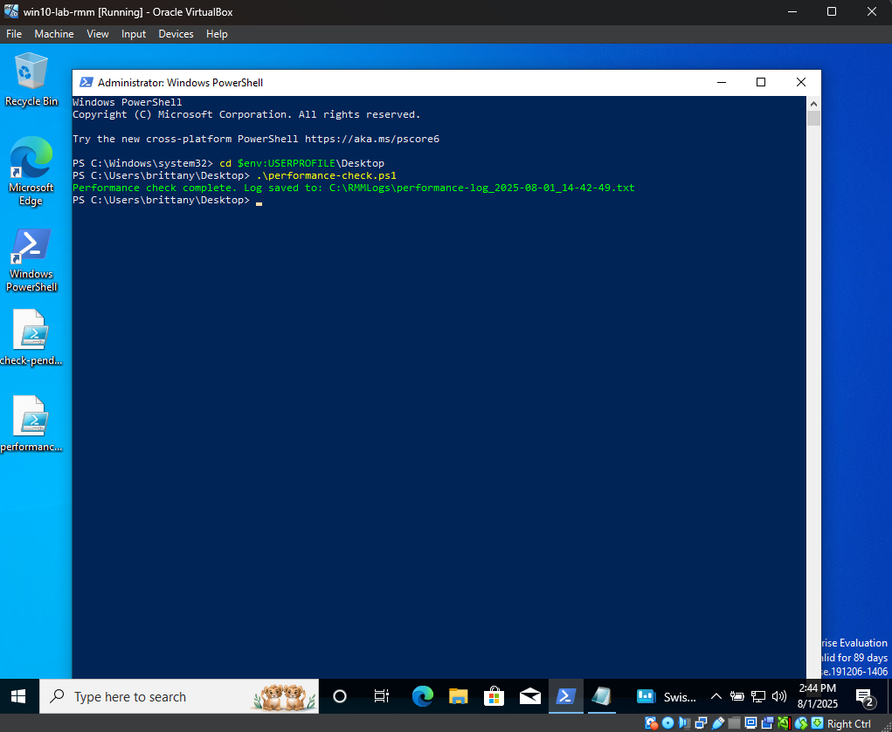
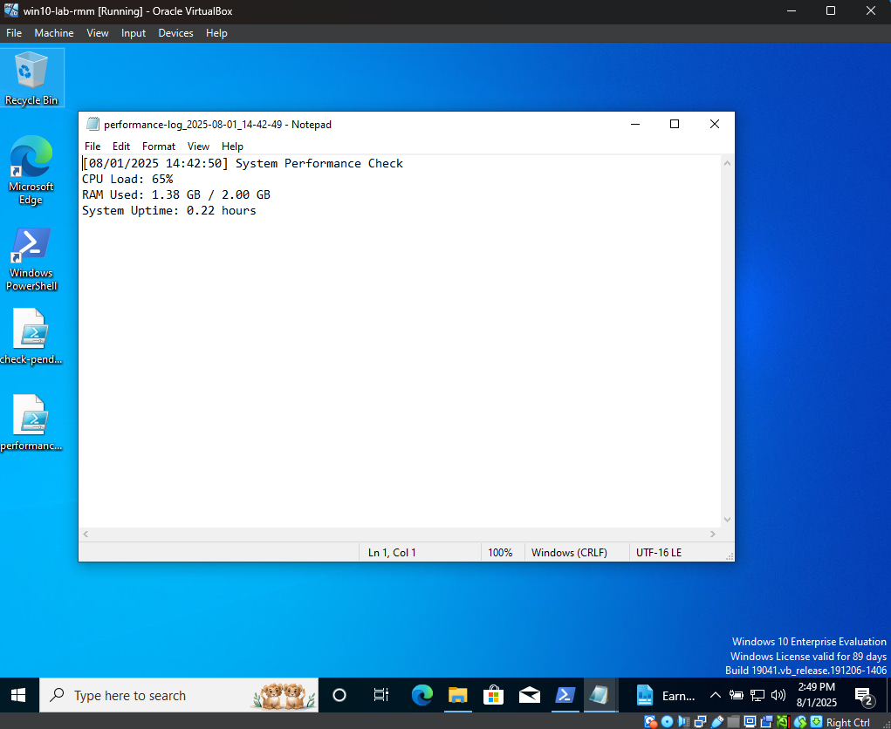

# Diagnostics Lab

This lab simulates basic endpoint troubleshooting using PowerShell.  
It checks CPU load, RAM usage, and system uptime — key metrics when diagnosing slow or misbehaving systems.

---

## Script: `performance-check.ps1`

This script collects and logs:
- **CPU Load**: average processor usage
- **RAM Usage**: how much memory is in use vs. total
- **System Uptime**: how long the system has been running since last reboot

It writes the results to a timestamped `.txt` file in `C:\RMMLogs`.

[View the script](./performance-check.ps1)

---

## Sample Log Output
[08/01/2025 14:42:50] System Performance Check
CPU Load: 65%
RAM Used: 1.38 GB / 2.00 GB
System Uptime: 0.22 hours

---

## Interpreting the Results

- **CPU Load: 65%**  
  This is moderate usage. If CPU stays above 80–90% consistently, it could indicate:
  - A background process consuming excess resources
  - A runaway task or malware
  - Security or update scanning is running

- **RAM Used: 1.38 GB / 2.00 GB**  
  This means the system is using around 69% of its available RAM. On low-memory systems, this could lead to:
  - Slow performance and lag when opening new apps
  - High disk usage due to pagefile/swap usage
  - System freezing if RAM hits 100%

- **System Uptime: 0.22 hours**  
  This system was recently rebooted (within the last ~13 minutes). Long uptimes (10+ days) may indicate:
  - Deferred updates not yet installed
  - Memory/resource leaks from unclosed processes
  - System not restarting after policy updates or scans

---

If issues are spotted, the next step would be:
- Identifying resource-heavy processes with Task Manager
- Rebooting the system
- Reviewing startup programs or active services

---

## Screenshots

### Script Run in PowerShell

---

### Log File Output

---

## Why This Matters

Support engineers often troubleshoot reports like “my system is slow” or “apps are freezing.” This demonstrates how to gather fast diagnostics to identify performance-related issues using basic tooling.

