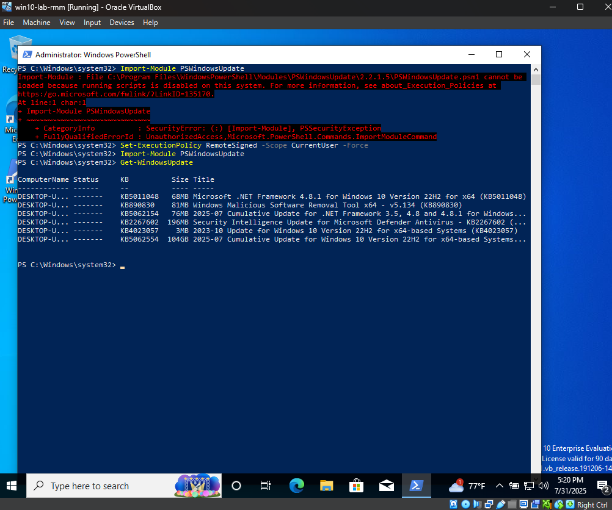
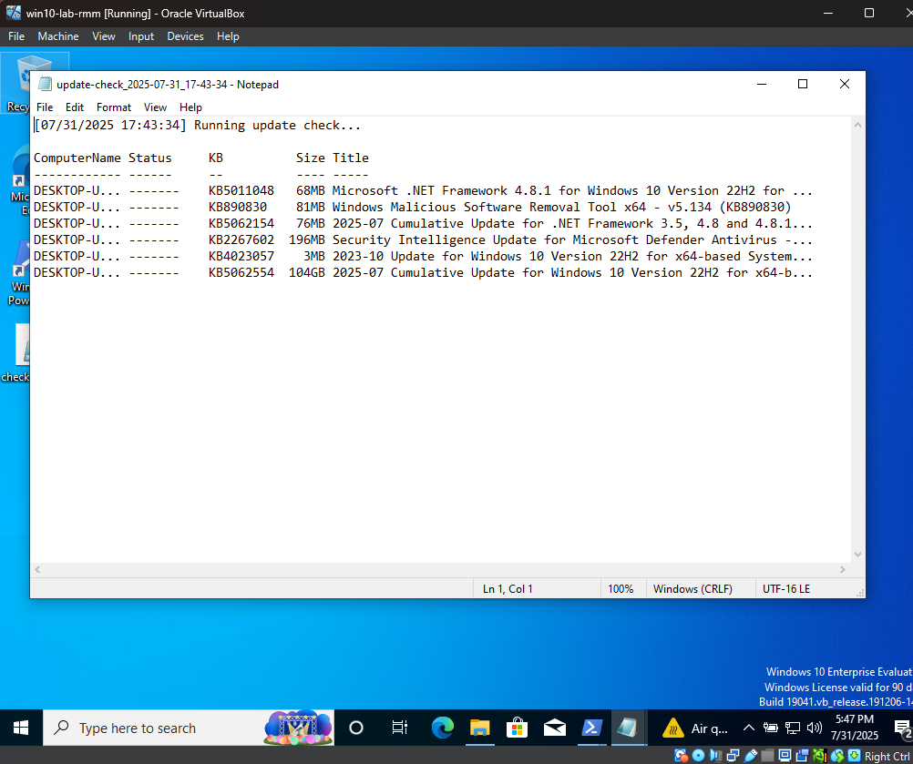

# Windows Update Monitoring Lab

This lab simulates how an RMM or endpoint security tool would check for pending Windows updates and log the results for review or escalation. Everything is done inside a Windows 10 VM using native PowerShell and the `PSWindowsUpdate` module.

---

## Goals

- Detect pending Windows updates
- Log results with a timestamp
- Show how simple PowerShell scripting can simulate automated monitoring

---

## Tools Used

- Windows 10 (Oracle VirtualBox)
- PowerShell 5.1
- PSWindowsUpdate module

---

## Script: `check-pending-updates.ps1`

What it does:

- Imports the Windows Update module  
- Creates a folder `C:\RMMLogs` if it doesn’t exist  
- Scans for available updates  
- Writes results to a timestamped `.txt` log file

---

## Output Screenshots

### PowerShell Terminal Output

This shows the update scan running successfully from the script.

---

### Log File Output

The results were saved to a text file inside `C:\RMMLogs`.

---

### Script File

The full script is available here:  
[check-pending-updates.ps1](./check-pending-updates.ps1.txt)

## Why This Matters

This simulates what RMM tools like ConnectWise or N-central do behind the scenes; check patch status, create logs, and act on missing updates. It’s a basic, realistic way to demonstrate endpoint visibility and scripting capability without needing enterprise software.
